<!-- HERO -->
# Arte & Ciência em Movimento — Matemática Viva 💎✨
[](https://teses.usp.br/teses/disponiveis/3/3151/tde-20102010-122044/en.php)
[](https://arxiv.org/abs/2504.01969)


**PT · EN · ES** · [Galeria](#galeria--gifs) · [Instalação](#instalação--installation--instalación) · [Licença MIT](#licença--license--licencia)

---
## 🌐 📊 QuantDataScience  
**Ciência de Dados com Aplicações Quantitativas e Financeiras**  
*Data Science with Quantitative and Financial Applications*  

---

## 🏆 Sobre este Repositório | About this Repository  
Este repositório é uma **trilha prática** para aprender **Ciência de Dados** de forma estruturada, com foco especial em **aplicações quantitativas e financeiras**. Aqui, você explorará simulações de risco, visualizações dinâmicas e precificação de opções com Python.  
*Here you will find a hands-on roadmap to learn Data Science, with a special focus on quantitative and financial applications, including risk simulations, dynamic visualizations, and option pricing with Python.*
# Galeria de Visualizações Futuristas do QuantDataScienceX

- **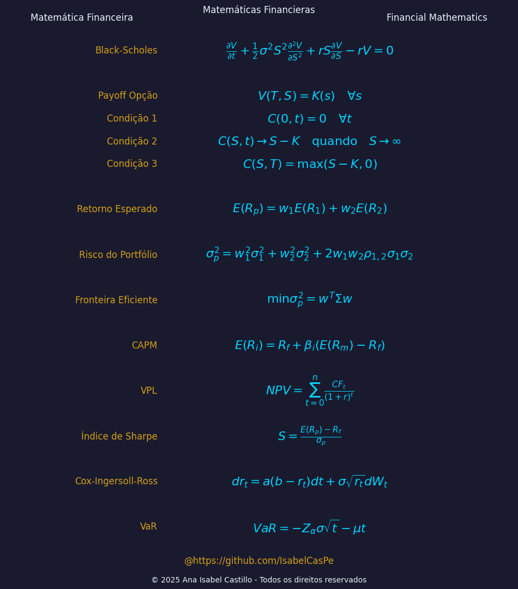** - Um banner matemático estelar para inspirar cálculos!  
- **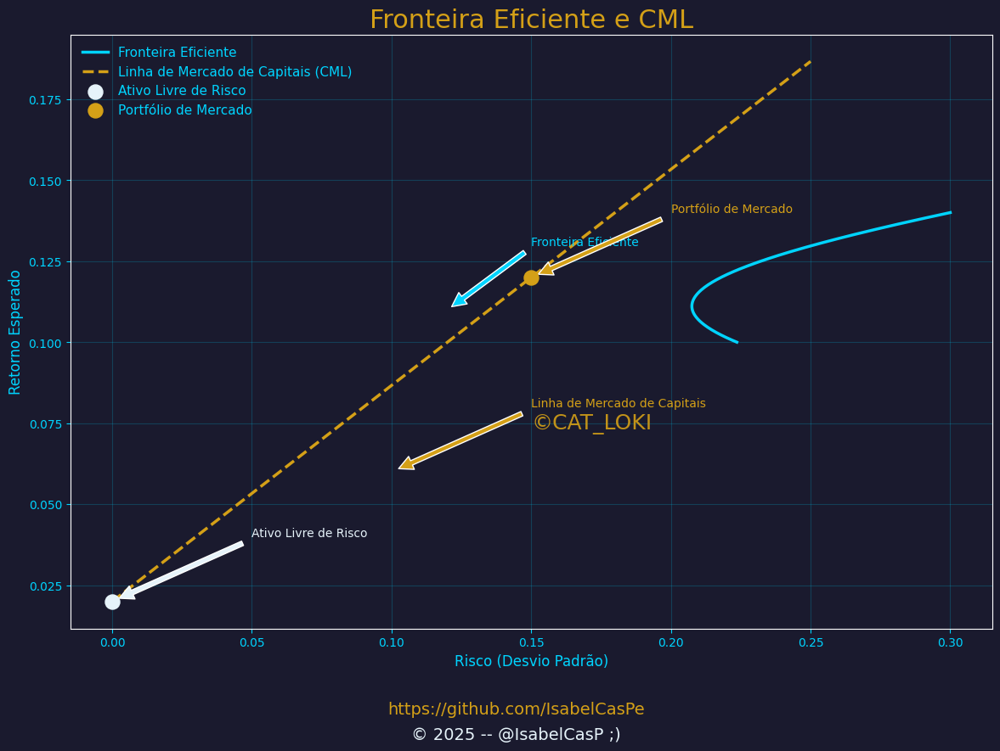** - Otimização de portfólio em ação!   
- **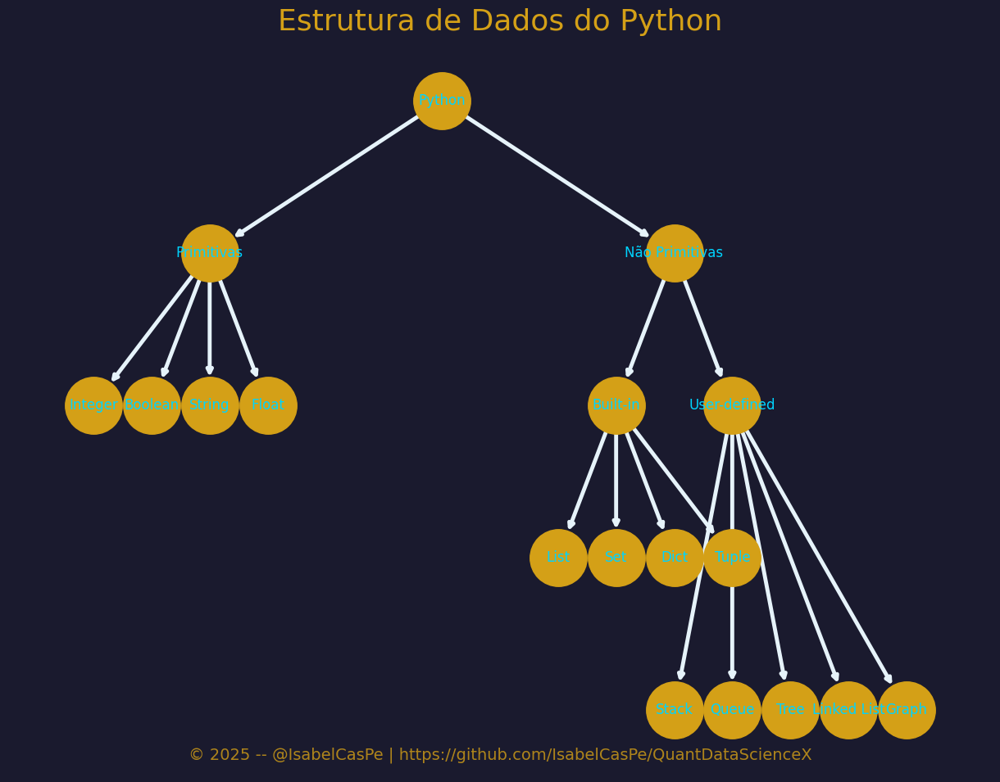** - Desvende a estrutura do Python com esta árvore futurista! 🌌
- **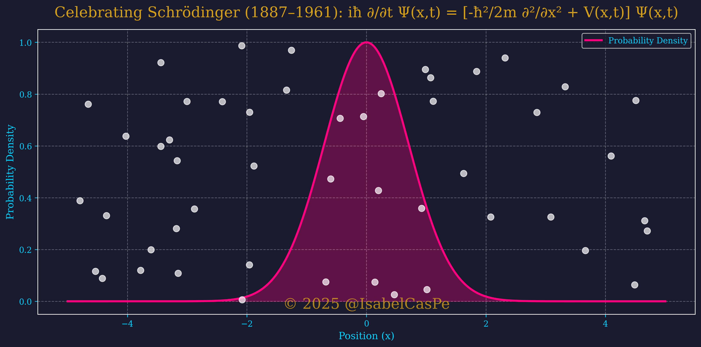** - Entre ondas dançantes e mares de probabilidades, celebramos Erwin Schrödinger (nascido em 12/08/1887), que transformou o invisível em ciência.
  Uma mente que ecoa em chips e sonhos quânticos, mesmo com um dia de delay!  @IsabelCasPe
- **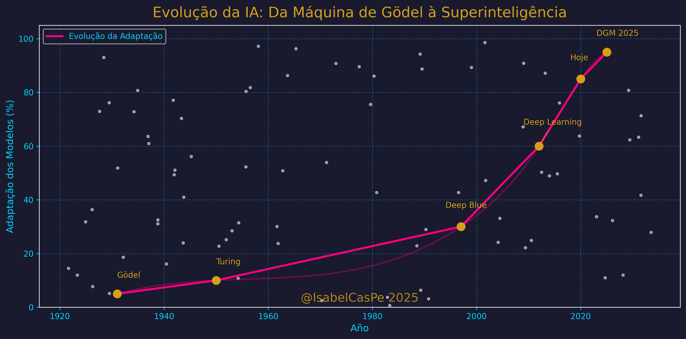** -  Esta imagem captura a evolução da IA entre limites e infinitos, inspirando meu repo QuantDataScienceX. Mergulha nos dados quânticos e nas estrelas do futuro.
- **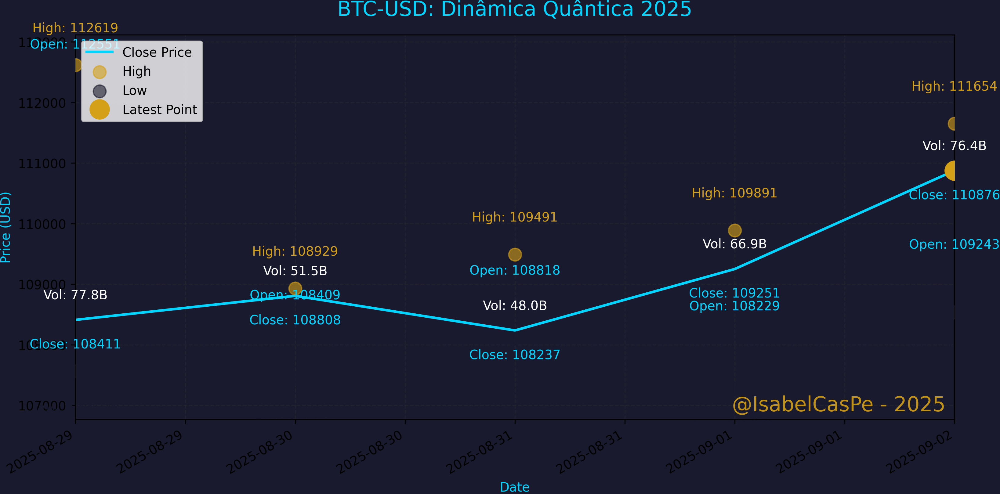** - BTC-USD, visão quant: OHLC + volume com anotação de extremos. Quant view: OHLC + volume with highlighted highs/lows.
---
# Animations Futuristas do QuantDataScienceX
- **** A 3D Quantum Financial Network 💎✨ 
A equação que aparece brilhando  𝐻∣𝜓⟩=𝐸∣𝜓⟩  é o coração da mecânica quântica (Schrödinger independente do tempo). Coloquei no vídeo como um ícone do meu 2030 quântico:
🌀𝐻 (Hamiltoniano): o operador que representa a energia total. Na minha analogia, é o “maestro” que governa como os nós (bancos) interagem.
🌀∣𝜓⟩: o estado quântico, a “alma” da rede, tudo que ela pode ser ao mesmo tempo.
🌀𝐸: a energia do estado; aqui, lê-se como estabilidade/valor de uma configuração da rede.
O que ela diz? Quando 𝐻 age em ∣𝜓⟩ e devolve o mesmo 
∣𝜓⟩ multiplicado por 𝐸, esse ∣𝜓⟩ é um autoestado (estacionário): uma configuração estável. É isso que a minha animação sugere uma rede financeira quântica em equilíbrio elegante, com os nós pulsando feito uma neural net quântica. Neon🌀 porque futuro é high-tech  e porque, sim, caos domado também pode brilhar.✨
--- 
- **** - Esta animação visualiza a evolução temporal da função de onda ψ(x,t)
 e sua densidade de probabilidade ∣ψ(x,t)|^2 ,  dentro de um poço de potencial infinito unidimensional, inspirada nos princípios da mecânica quântica. Implementada com Matplotlib, a simulação alterna entre estados próprios e superposições de estados (n=1,2), incorporando modulações de fase para enriquecer a dinâmica da onda. Estrelas cósmicas, com movimento aleatório e cintilância, simbolizam a interconexão entre o microcosmo quântico e o macrocosmo estelar, refletindo a evolução da inteligência artificial até 2025. 
- **** - Projeções para 2045. 
---

## Aviso Importante! 
🎥 Nota pra galera:  
As simulações dinâmicas aqui são puro amor quântico, mas o GitHub só aceita arquivos até 25 MB. Algumas versões mais caprichadas (e pesadas!) podem não subir. Fiquem de olho nas redes ou me avisem pra compartilhar o brilho! 🌟  
© 2025 @IsabelCasPe

---

# Schrödinger Tribute: Quantum Mechanics Pioneer **Erwin Schrödinger** (1887–1961), focando em sua equação, no paradoxo do gato e no impacto interdisciplinar. Desenvolvido com uma paleta quântica para fins educacionais..

## Files
-  
  
-----


© 2025 @IsabelCasPe | [https://github.com/IsabelCasPe/QuantDataScienceX](https://github.com/IsabelCasPe/QuantDataScienceX)
---

## 📚 QuantDataScienceX: Análises Reais do Mercado com Dados do Yahoo Finance e Uma Pitada de Futuro Quântico. 
- [apresenta.pdf](apresenta.pdf): QuantDataScienceX!  O Futuro das Finanças.
- [BTC](btc.pdf): Dinâmica do BTC
- [Relatório: SPY vs QQQ (1 Ano)}](RelatorioQQQandSPY.pdf) : Desvende o futuro financeiro com $SPY e $QQQ  
- [Análise Estatística e Risco no Mercado de Petróleo - 2025](PetroRelatorio.pdf) : Explorar o mercado de petróleo (WTI, Brent, Petrobras) com dados em tempo real.
- [Avaliar : {BBAS3, ITUB4, BBDC4, SANB4}](RelatorioDe4Banks.pdf) : Oportunidade em dividendos, O ITUB4 e BBDC4 lideram o Dividend Yield na amostra.
- --
## 📚 Estrutura do Curso | Course Structure
---
### 1️⃣ Introdução & Setup  
- Introdução à Ciência de Dados / *Introduction to Data Science*
- [Bem-vindo ao Futuro da Finança Quântica](Introduction.pdf)
- Configuração de ambiente (`Python`, `Jupyter Notebook`, `GitHub`)  
- Exemplo: Crie seu primeiro ambiente com `pip install pandas`.  
- 📂 Pasta: `01-introducao`

### 2️⃣ Manipulação de Dados | Data Manipulation  
- **Pandas** e **NumPy**  
- Limpeza, transformação e preparação de dados  
- Exemplo: Carregue e limpe dados financeiros com `pd.read_csv()`.  
- 📂 Pasta: `02-tratamento-dados`

### 3️⃣ Visualização de Dados | Data Visualization  
- **Matplotlib** e **Seaborn**  
- Storytelling com dados e dashboards simples  
- Exemplo: Crie gráficos de séries temporais pra analisar volatilidade.  
- 📂 Pasta: `03-visualizacao-dados`

### 4️⃣ Estatística para Ciência de Dados | Statistics for Data Science  
- Medidas descritivas, distribuições  
- Testes de hipóteses  
- Exemplo: Calcule a média e desvio de retornos de ações.  
- 📂 Pasta: `04-estatistica`

### 5️⃣ Introdução a Machine Learning | Intro to Machine Learning  
- Regressão linear e logística  
- Métricas de avaliação de modelos  
- Exemplo: Treine um modelo pra prever preços com `scikit-learn`.  
- 📂 Pasta: `05-machine-learning`

### 6️⃣ Aplicações em Finanças | Financial Applications  
- Análise de risco  
- Precificação de opções (ex.: Black-Scholes)  
- Séries temporais financeiras  
- Exemplo: Implemente o modelo Black-Scholes com dados como GOLL4.SA.  
- 📂 Pasta: `06-projetos-financas`

### 7️⃣ Projeto Final | Final Project *(Opcional)*  
- Une todos os conceitos em um case prático  
- Exemplo: Análise de Risco de Portfólio com dados reais.  

---

## 📂 Estrutura de Pastas | Folder Structure  
- `01-introducao`: `intro.ipynb`, `setup_guide.md`  
- `02-tratamento-dados`: `data_cleaning.py`, `numpy_exercises.ipynb`  
- `03-visualizacao-dados`: `volatility_plot.py`, `seaborn_dashboard.ipynb`  
- `04-estatistica`: `stats_calcs.py`, `hypothesis_test.ipynb`  
- `05-machine-learning`: `linear_regression.py`, `model_metrics.ipynb`  
- `06-projetos-financas`: `black_scholes.py`, `risk_analysis.ipynb`  
- `07-projeto-final`: `portfolio_risk.ipynb`  

---
## ✨ Reflexões Quânticas

Algumas das frases que inspiram este repositório:

**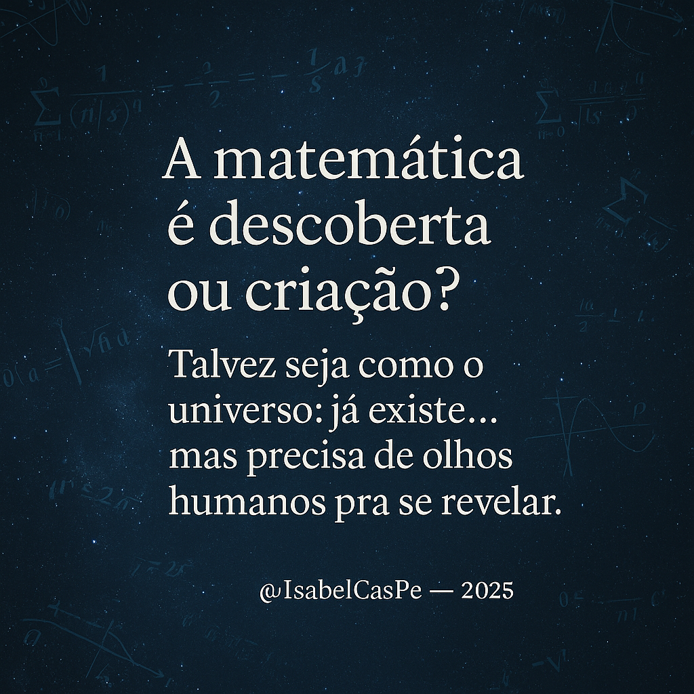** “A matemática é descoberta ou criação? Talvez seja como o universo: já existe… mas precisa de olhos humanos pra se revelar.” 🌌♾️

**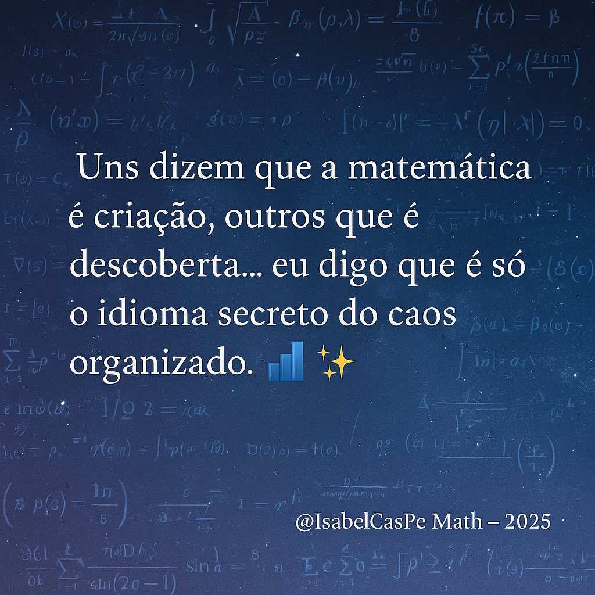** “Uns dizem que a matemática é criação, outros que é descoberta… eu digo que é só o idioma secreto do caos organizado.” 📊✨

**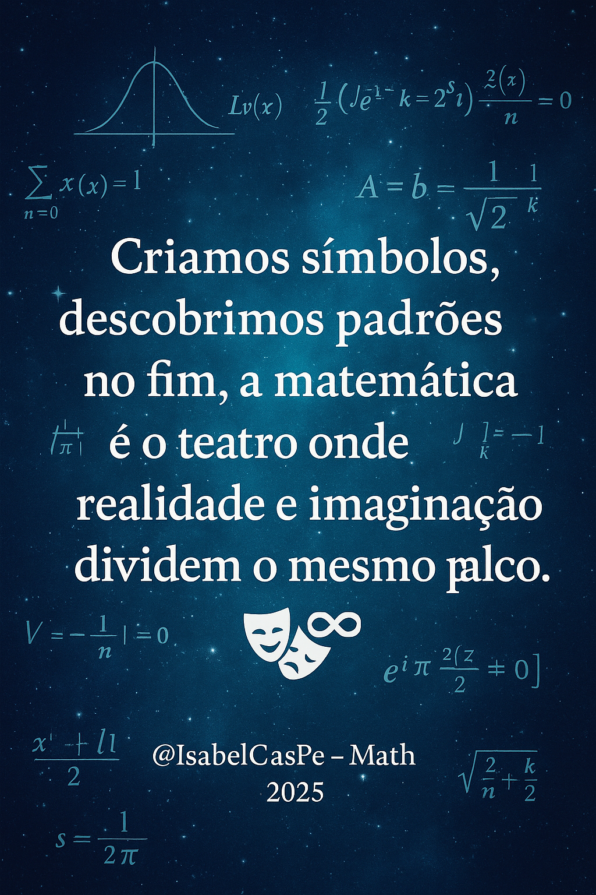** “Criamos símbolos, descobrimos padrões — no fim, a matemática é o teatro onde realidade e imaginação dividem o mesmo palco.” 🎭♾️

**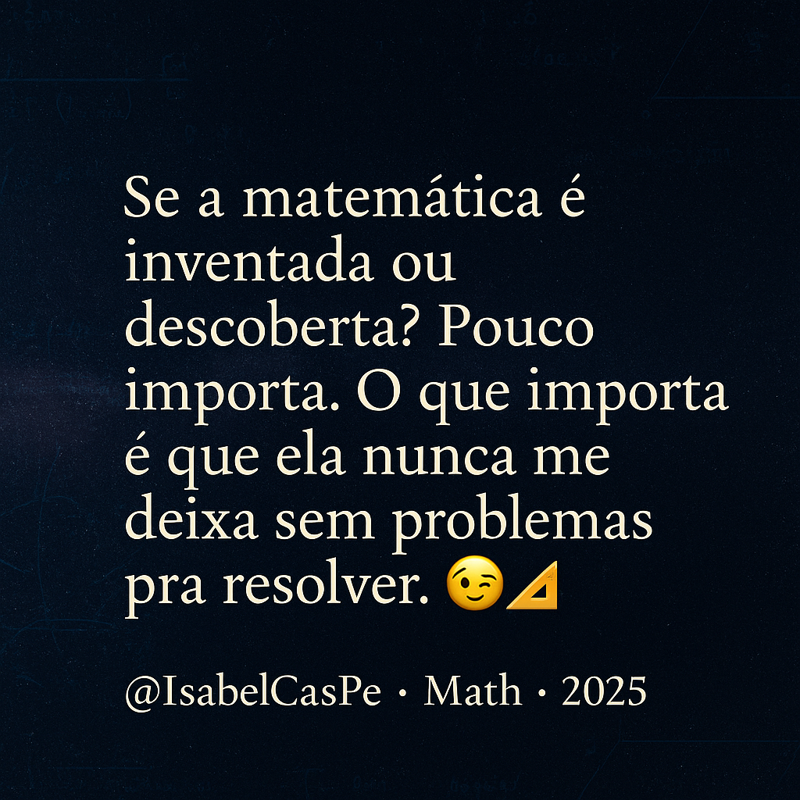** “Se a matemática é inventada ou descoberta? Pouco importa. O que importa é que ela nunca me deixa sem problemas pra resolver.” 😏📐

**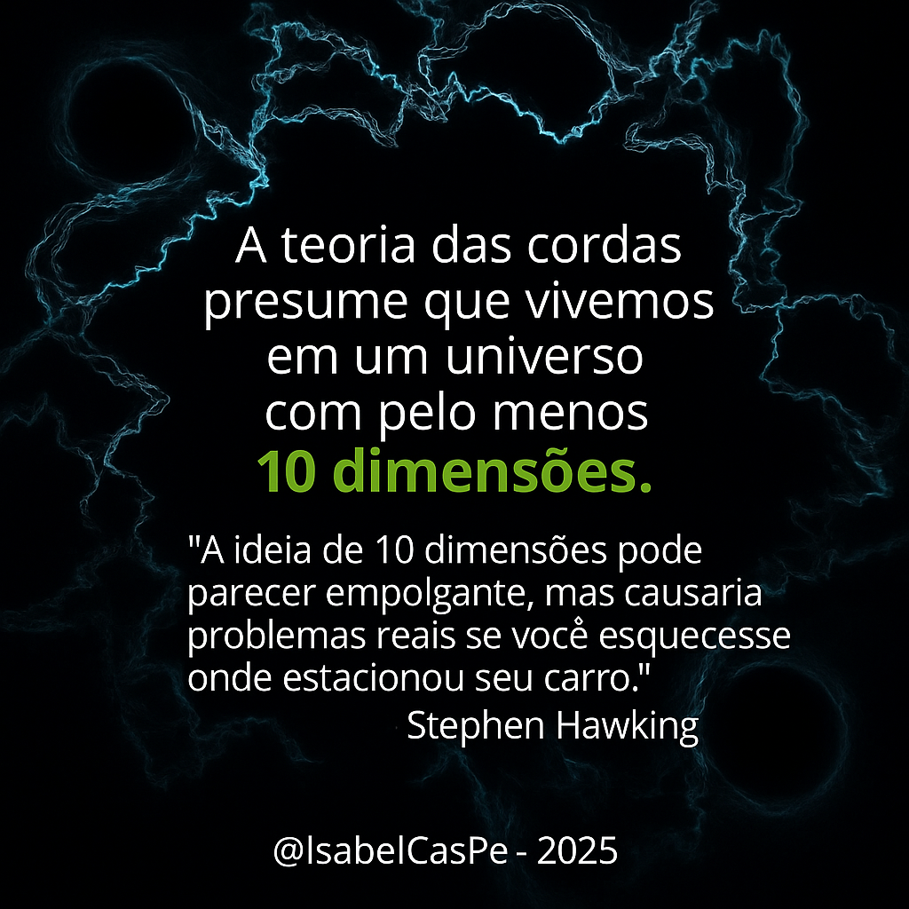** “A ideia de 10 dimensões pode até fascinar, mas imagina o caos pra achar o carro num multiverso! 🚗♾️” — inspirado no humor cósmico atribuído a Stephen Hawking. 🌌

---

## 🤝 Como Contribuir | How to Contribute  
- Abra issues ou envie pull requests com sugestões!  
- Teste os códigos e compartilhe feedbacks.  
- Contato: [anacp20@gmail.com](mailto:anacp20@gmail.com)  

## 📊 Status  
[](https://github.com/isabelcaspe/QuantDataScience/issues)  
[](https://github.com/isabelcaspe/QuantDataScience/commits/main)
---
## ☕
- 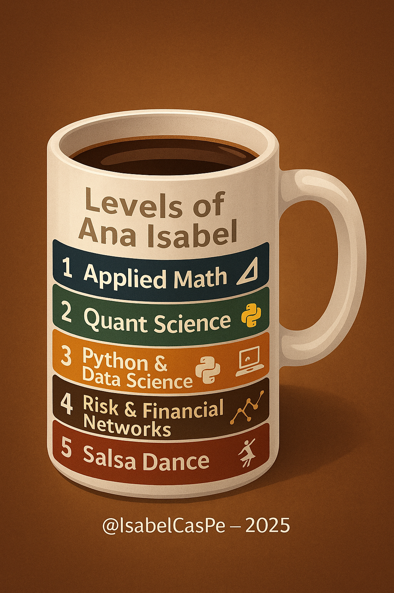
---

## Licença | License: Este repositório está sob a MIT License (LICENSE).
- Códigos Python: [MIT License](LICENSE)  © Copyright 

<p align="center">
  
</p>

<p align="center">
  <sub><b>@IsabelCasPe</b> 💙✨ — <i>Cosmos em código: ciência que vira arte.</i> 💎♾️</sub>
</p>

## Inspiração
> "A abundância flui naturalmente em minha jornada, encontro amor e paz em cada passo, e sou grata pela sabedoria que ilumina meu caminho. As zoeiras são parte da minha alegria compartilhada!" ;)  
> © Copyright - 2025 **Prof. Ana Isabel Castillo** - @IsabelCasPe 💎✨
---
## Instalação · Installation · Instalación
```bash
python -m venv .venv && source .venv/bin/activate
pip install -r requirements.txt
python main.py


